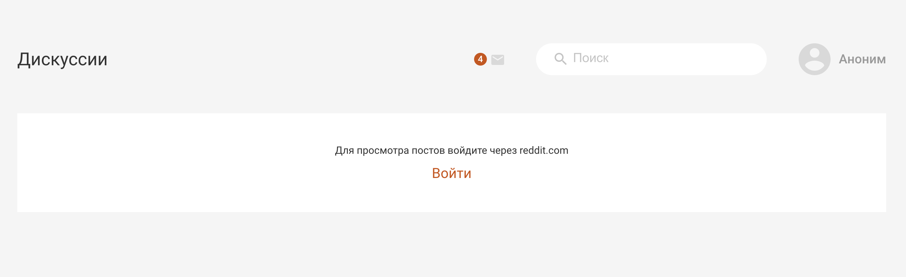

# Reddit Mirror
Сайт для просмотра актуальных новостей с reddit.com

## Технологии
- [React](https://ru.reactjs.org/)
- [TypeScript](https://www.typescriptlang.org/)
- [Redux](https://redux.js.org/)
- [React-router-dom](https://v5.reactrouter.com/web/guides/quick-start)
- [axios](https://axios-http.com/ru/docs/intro)
- [express](https://expressjs.com/ru/)

## 🚀 Для запуска проекта выполни следующие шаги
1. Скачай и установи Node.js.
2. Выполни в консоли команду `node -v` и убедись, что установлена версия Node.js не ниже v14.15.1;
3. Введи в консоли `npm -v` и убедись, что установлена версия npm не ниже 6.14.8;
4. Скачай и установи Git, если его нет на компьютере;
5. Введи `git --version`, чтобы проверь версию установленного Git, должно быть не ниже 2.27.0;
6. Склонируй этот репозиторий, выполнив команду: `git clone https://github.com/tamaradzhahparova/redditMirror.git`;
7. Чтобы перейти в директорию с проекта, после клонирования выполни команду `cd redditMirror`;
8. Чтобы установить зависимости проекта, выполни команду `npm install`;
9. Чтобы запустить проект в режиме разработки, самое время выполнить  команду `npm run dev`;
10. Перейди в браузер и открой страничку http://localhost:3000. Когда страничка загрузится, ты увидишь страницу с формой регистрации. При клике на кнопку "Войти" ты будешь перенаправлен на сайт reddit.com, где тебя попросят предоставить доступ к нашему приложению.
11. После авторизации на reddit.com ты сможешь пользоваться сайтом.  

### Демо

[reddit mirror](https://my-own-reddit.herokuapp.com/posts)

